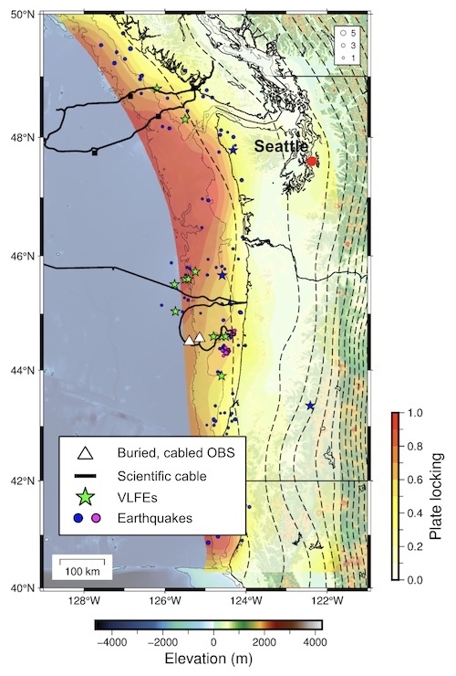

I study seismic signals recorded on ocean bottom seismometers (OBS), including earthquakes and tremor, to learn about mid-ocean ridge and subduction zone processes.

# The Cascadia Subduction Zone

## Searching for shallow tremor in the Cascadia subduction zone using cabled OBS

 An important standing question, with strong implications for the hazard expected from a large earthquake, is: how much deformation occurs on the shallow portion of the Cascadia subduction zone? Does any slip occur on the shallow plate interface, and/or surrounding subducting seamounts and splay faults? We need direct ocean bottom observations to answer these questions.

To work towards answering these questions, I am starting a project to analyze seismic time series from two cabled broadband OBS on the Ocean Observatories Initiative near the Cascadia subduction zone deformation front. We are searching for evidence of non-volcanic tremor, with a plan to classify seismic signals using unsupervised learning and comparison to environmental (wind, currents) time series. 

# The Juan de Fuca Ridge

## Long-term earthquake monitoring of the Endeavour segment using cabled OBS

My master's work compiled more than 20 years of OBS network data from multiple deployments to create a long-term earthquake catalog for the Endeavour segment of the Juan de Fuca ridge, an intermediate-rate spreading ridge off the coast of the Pacific Northwest. 

This catalog suggests that the next extensional spreading event at the Endeavour segment will occur within the next 5 years. We are currently monitoring the ongoing seismicity [here](endeavour.ocean.washington.edu). 

I am working with scientists at Ocean Networks Canada to monitor activity at the Endeavour segment using the NEPTUNE cabled OBS network.

This work has been published in [Journal of Geophysical Research: Solid Earth](https://agupubs.onlinelibrary.wiley.com/doi/full/10.1029/2022JB025662).

## Earthquake monitoring using a single ocean bottom seismometer

For the period of 2011-2016, there was only one OBS functioning at the Endeavour segment. This is valuable data that we want to make the most of- but it is challenging to detect and locate earthquakes without a multi-station network!

I have explored methods of single-station earthquake location that utilize the P, S, and Pw (sea surface reflection), and created a single-station earthquake catalog for 2011-2016 for the Endeavour segment that help to fill in the catalog of Krauss et al. (2023).

I am working to write up this project and will have something to share soon!

## Investigating small repeating earthquakes at the Endeavour Segment

During my master's work, we noticed that many of the earthquakes at the Endeavour segment arrived as series of highly similar multiplets, hinting at tantalizing evidence of repeating earthquakes! 

I am working to identify and characterize these "repeating" earthquakes using template matching and waveform clustering. We think this may help us understand how the hydrothermal circulation cells at the Endeavour segment work, and if, where, and when any of the seafloor spreading is accomplished through slow slip. 

I presented preliminary results of this work at AGU 2022. 

# Cloud resources for running earthquake detection workflows

With Marine Denolle's group and collaborators at UW's eScience Institute, I have been working to migrate our local earthquake detection workflows onto the Microsoft Azure cloud. 

We have developed and documented our experience with the cloud, including timing and costs associated with scaling, in the hopes that it may be a helpful starting point for other seismic researchers.

I presented this work at SSA 2023 and we recently submitted a manuscript describing this work for publication.
You can find the codes and tutorials associated with this project [here](https://github.com/Denolle-Lab/seismicloud/tree/main). 

